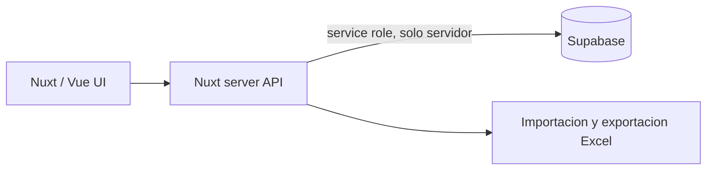

# School Voting Platform

Plataforma para digitalizar elecciones escolares, administrar alumnos por
seccion, emitir votos y consultar resultados. Esta construida como aplicacion
full stack con Nuxt 4, Vue 3, TypeScript y Supabase.

## Funcionalidades

- Inicio de sesion y sesiones de docentes/administradores.
- Importacion masiva de alumnos desde Excel.
- Alta y eliminacion de alumnos.
- Flujo de votacion con verificacion previa y control de voto emitido.
- Opcion configurable de voto en blanco.
- Avance de votacion por salon y consulta en tiempo real.
- Resultados agregados y exportacion a Excel.
- Separacion entre credenciales publicas y `service role` del servidor.

## Arquitectura



Las operaciones privilegiadas viven en `server/api`; la clave `service role` no
se expone al navegador.

## Stack

- Nuxt 4 y Vue 3
- TypeScript
- Supabase
- ExcelJS y un parser CSV local sin dependencias vulnerables

## Configuracion

Requiere Node.js 20+ y un proyecto Supabase con las tablas utilizadas por los
endpoints de `server/api`.

Crea un archivo `.env` local:

```dotenv
SUPABASE_URL=https://your-project.supabase.co
SUPABASE_KEY=your-public-anon-key
SUPABASE_SERVICE_ROLE=your-server-only-service-role
PUBLIC_RESULT_BLOCK=3
PUBLIC_VOTO_BLANCO=si
PUBLIC_DEMO_FALLBACK=true
```

No publiques `SUPABASE_SERVICE_ROLE`; Nuxt la mantiene dentro de
`runtimeConfig` privado.

`PUBLIC_DEMO_FALLBACK=true` mantiene la ruta publica de resultados util para
una revision de portafolio cuando Supabase no esta disponible. En ese caso la
interfaz muestra un aviso visible y usa exclusivamente datos simulados. Usa
`false` en un despliegue operativo si prefieres mostrar el error real.

## Ejecucion

```bash
npm ci
npm run dev
```

Build de produccion:

```bash
npm run build
npm run preview
```

## Rutas principales

- `/login`: autenticacion.
- `/docente`: gestion de alumnos y seguimiento.
- `/votar`: flujo de votacion.
- `/resultados`: resultados agregados.

## Limitaciones conocidas

- El esquema y las politicas RLS de Supabase deben versionarse antes de un
  despliegue reproducible.
- El modo demostracion no habilita login, administracion ni emision de votos;
  solo permite revisar la interfaz publica de resultados con datos simulados.
- Para una eleccion oficial se requiere auditoria independiente, pruebas de
  carga, respaldo y un modelo formal de amenazas.

Estas limitaciones se mantienen explicitas para no presentar una aplicacion
escolar como un sistema electoral certificado.
