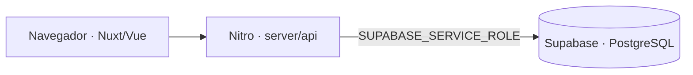

# Contrato de datos y seguridad

Este documento describe el contrato que utiliza actualmente el código de
`server/api`. No es una migración ni afirma que un proyecto remoto tenga estas
restricciones aplicadas. Su objetivo es hacer explícitas las dependencias de
datos antes de versionar el esquema real de Supabase.

## Límite de confianza actual

El navegador llama a las rutas Nitro y no consulta tablas de Supabase de forma
directa. La clave `SUPABASE_SERVICE_ROLE` se lee desde la configuración privada
del servidor. Como esa credencial omite RLS, las políticas de las tablas no
sustituyen la autenticación y autorización de cada endpoint Nitro.

## Tablas consumidas

La siguiente lista se deriva de las selecciones, filtros e inserciones presentes
en el repositorio.

| Tabla | Columnas utilizadas | Observaciones verificables en el código |
| --- | --- | --- |
| `alumnos` | `dni`, `nombres`, `apellidos`, `grado`, `seccion`, `ya_voto` | `dni` se usa como conflicto de los `upsert`; `grado` se compara como texto y `ya_voto` como booleano. |
| `candidatos` | `id`, `nombre`, `descripcion`, `activo` | La pantalla de votación carga únicamente candidatos activos. |
| `votos` | `dni`, `candidato_id`, `en_blanco`, `grado`, `seccion`, `creado_en` | `candidato_id` puede ser nulo para un voto en blanco; resultados y exportación ordenan por `creado_en`. |
| `usuarios` | `id`, `email`, `password`, `role` | El login actual es demostrativo y compara la contraseña recibida directamente. |
| `resultados_publicos` | `id`, `last_public_total`, `payload`, `updated_at` | Se mantiene un snapshot con el identificador `general` para publicar resultados por bloques. |

La interfaz vigente emite votos mediante `/api/votos/emitir`. El endpoint legado
`/api/votar` usa los nombres `alumno_dni` y `lista_id`, no es llamado por las
páginas actuales y no forma parte del contrato anterior.

## Invariantes que debe formalizar la migración

Estas reglas se desprenden del comportamiento esperado, pero todavía no están
versionadas en este repositorio:

- `alumnos.dni` debe ser único para que los `upsert` y la verificación sean
  deterministas.
- Cada voto debe pertenecer a un alumno existente y, salvo el voto en blanco, a
  un candidato existente.
- La base debe impedir más de un voto por alumno. La comprobación de
  `ya_voto` y la inserción deben resolverse de forma atómica para evitar carreras.
- `resultados_publicos.id` debe ser único para que el `upsert` del snapshot
  `general` sea determinista.

## Política RLS prevista

Si toda la lectura y escritura continúa pasando por Nitro, el punto de partida
seguro es habilitar RLS y no conceder acceso directo a `anon` ni
`authenticated`. Las rutas públicas y administrativas deben autorizarse en el
servidor antes de utilizar la credencial `service role`.

Antes de describir RLS como una característica implementada faltan cambios de
producto verificables:

1. Versionar tablas, índices, claves foráneas y políticas como migraciones.
2. Reemplazar contraseñas en texto directo por Supabase Auth o hashes robustos.
3. Validar la sesión y el rol en cada endpoint administrativo.
4. Registrar el voto y actualizar `ya_voto` en una única transacción o función
   PostgreSQL.
5. Probar con roles `anon`, `authenticated` y `service_role` que no exista
   acceso involuntario.

Hasta completar esa lista, el proyecto se presenta correctamente como una
demostración de portafolio y no como un sistema electoral certificado.
